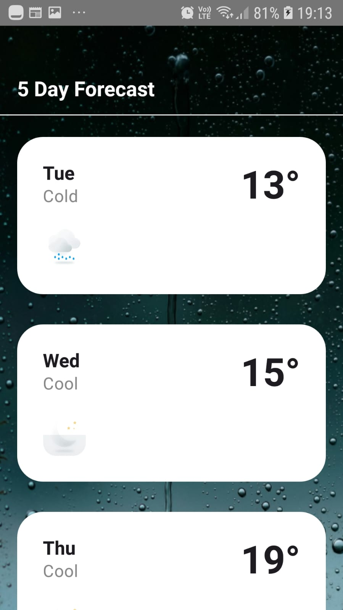

### Weather App 🌤️
A production-quality Android weather app built with modern Android development practices. This project serves as a personal canvas for applying and showcasing Clean Architecture, reactive programming with Kotlin Flow, and Jetpack Compose UI.

### Architecture
The app follows Clean Architecture with MVVM, structured in three distinct layers:

- Data layer — DTOs, Room entities, repository implementation, API + database sources
- Domain layer — pure Kotlin models, repository interface, business logic (no Android dependencies)
- UI layer — Jetpack Compose screens, ViewModel with sealed WeatherUiState

### Key architectural decisions:
- Sealed interface WeatherUiState (Loading, Success, Error, PermissionDenied) drives all UI states
- StateFlow built from a merge of refreshTrigger and permissionState flows — no manual state pushing
- Repository pattern abstracts data sources from domain
- Network-first with cache fallback — Room is the single source of truth
- Hilt for dependency injection split across focused modules (Network, Database, Location, Repository)

### Features

- 5-day weather forecast based on device GPS location
- Offline caching with Room database — works without internet
- Dynamic background and icons based on weather condition and time of day
- Permission handling for location access
- Error and loading states handled in UI

### 📸 Screenshots

### Third-Party Packages

| Package | Purpose |
|---------|---------|
| `com.google.dagger:hilt-android` | Dependency injection |
| `com.squareup.retrofit2:retrofit` | HTTP networking |
| `com.squareup.okhttp3:logging-interceptor` | HTTP request/response logging |
| `org.jetbrains.kotlinx:kotlinx-serialization-json` | JSON deserialization |
| `com.jakewharton.retrofit:retrofit2-kotlinx-serialization-converter` | Retrofit + Kotlinx Serialization bridge |
| `androidx.room:room-runtime` | Local database for offline caching |
| `com.google.android.gms:play-services-location` | Device GPS location access |
| `io.mockk:mockk` | Mocking for unit tests |
| `app.cash.turbine:turbine` | StateFlow testing |
| `com.google.truth:truth` | Fluent test assertions |

### Additional Notes

- `local.properties` is excluded from version control — API key must be added manually
- The app requests `ACCESS_FINE_LOCATION` permission at runtime — forecast will not load if denied
- OpenWeatherMap free tier returns 3-hour interval forecasts — the app groups these by day and takes the daily maximum temperature
- Background and icons update dynamically based on device time using `TimeOfDay` enum (`MORNING`, `AFTERNOON`, `EVENING`, `NIGHT`)
- Room database acts as a cache — stale data is shown when the device is offline